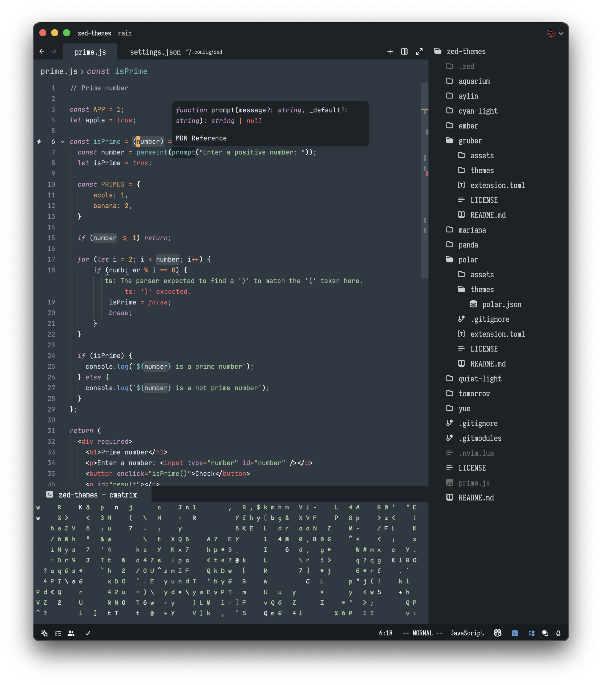
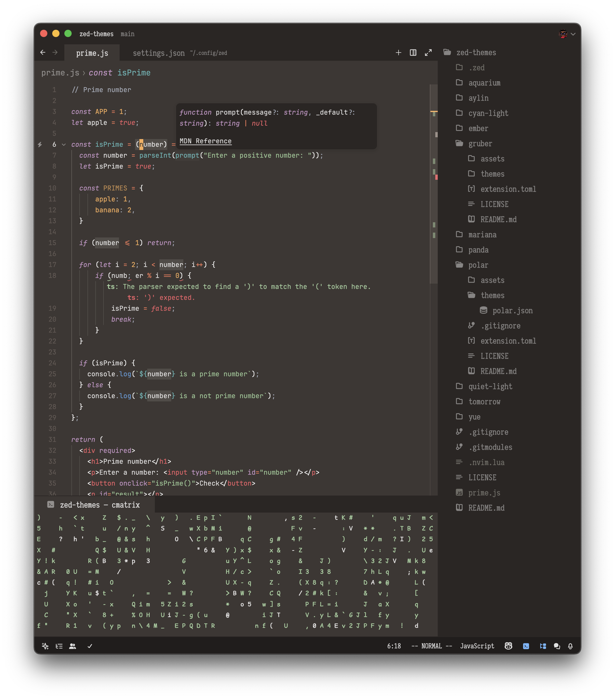
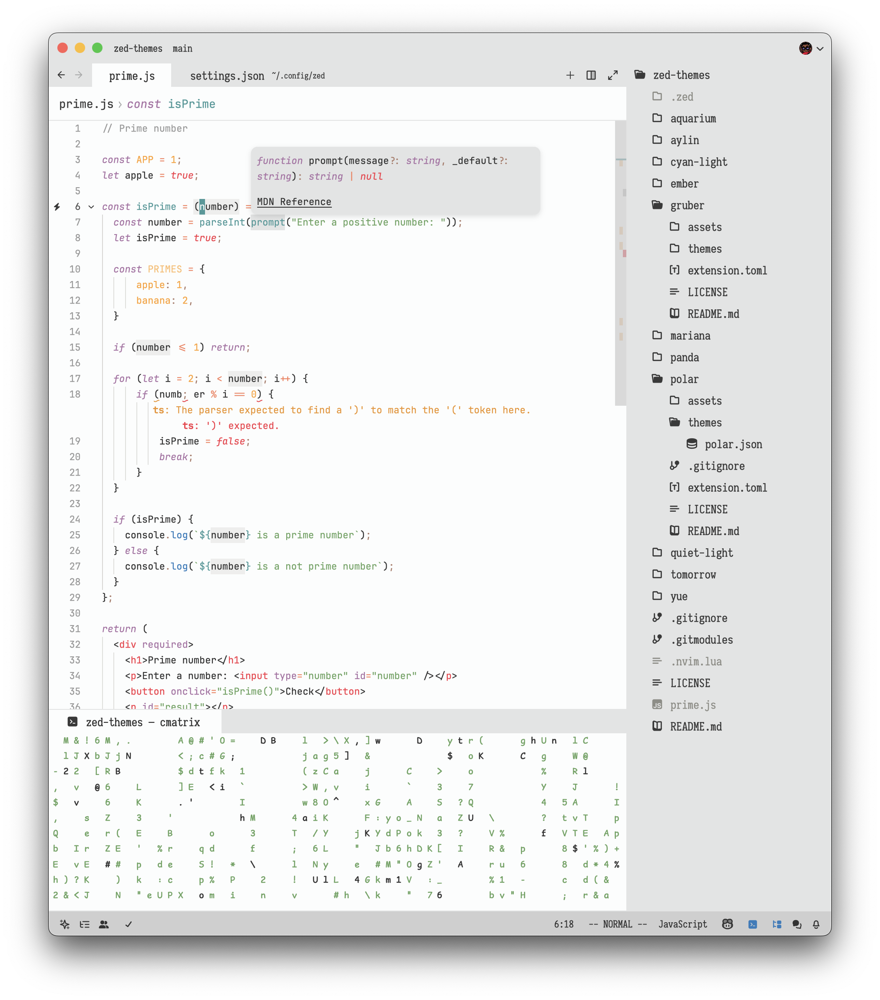
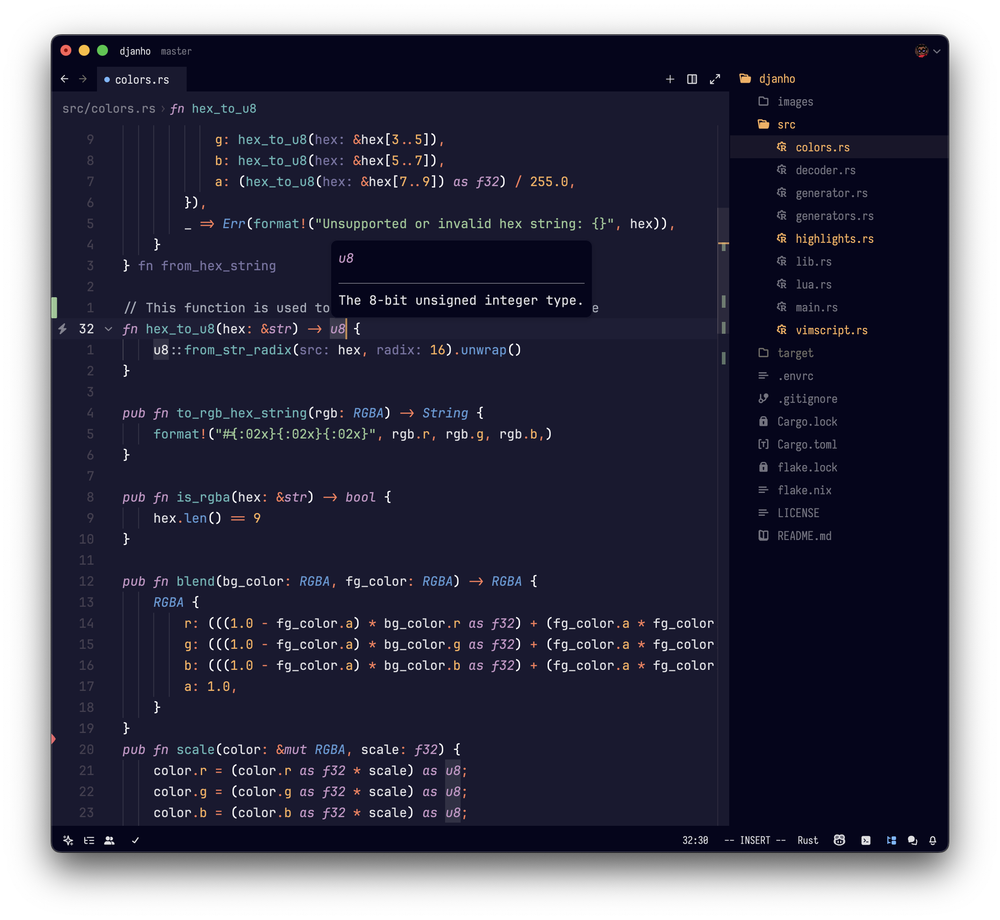

# Mariana
`variants: [Depths (might remove), Trench, Breakers, Sublime]`

based on the default Mariana and Breakers theme in Sublime Text & [Mariana Pro Warm](https://arc.net/l/quote/erujorqf) Vscode Theme

## Preview
### Mariana

### Mariana Trench

### Mariana Breakers

### Mariana Depths

## Installation
1. Copy mariana.json to ~/.config/zed/themes/
2. Open Zed and navigate to Settings -> Theme -> Mariana
